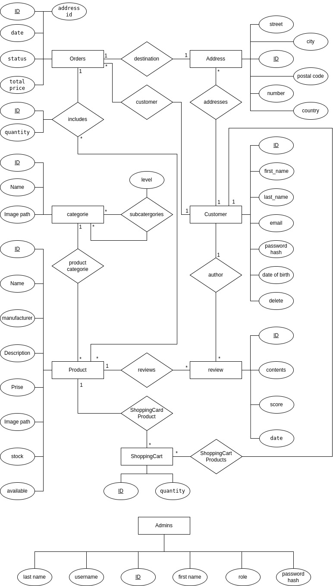

# webShop

## Description
This is a simple web shop project. It is a school project for the subject Web programming. The project is written in PHP, javascript, css and html.

## Installation
### Installation docker
1. Clone the repository
2. **check if thare is a folder named logs in the src folder. If not create one.**
3. Run the following command in the root of the project:
```
docker-compose up --build -d
```
4. Open the browser and go to [http://localhost:8080](http://localhost:8080) to see the project (to see phpmyadmin go to [http://localhost:8081](http://localhost:8081))
5. The project is now running
  (To debug the project you can use xdebug in vscode.)
6. To stop the project run the following command in the root of the project:
```
docker-compose down
```
### Installation without docker
1. Clone the repository
2. Install a web server (for example apache)
3. Install a database server (for example mysql)
4. Create a database and import the sql file from the docker/mysql/init-db.sql
5. Change the database connection in the src/config.php file
6. copy the src folder to the web server
7. **check if thare is a folder named logs in the src folder. If not create one.**
8. **check if thare is a folder named uploads in the src folder. If not create one.**
9. **check if thare is a folder named products in the src/uploads folder. If not create one.**
10. **check if thare is a folder named categories in the src/uploads folder. If not create one.**

## Usage
The project is a simple web shop. You can register, login, add products to the cart and buy them.
### Pages
- customer side: server/index.php (docker: [http://localhost:8080](localhost:8080))
- admin side: server/admin/login.php (docker: [http://localhost:8080/admin/login.php](localhost:8080/admin/login.php))
### customer functions
- Register
- Login
- Add products to the cart
- Buy products
- See the order history
- delete the account
- search for products
- click true categories
- add and view reviews
- change website theme
### admin functions
- Add products
- login
- Edit products
- Delete products
- See all orders
- Change the order status
- Add categories
- Edit categories
- Delete categories if there are no products or subcategories in it
- see users and order history
- admin page gives an overview of the orders and users
- change website theme
### SAdmin functions
- all the admin functions
- Add admins and SAdmins
## Database diagram

